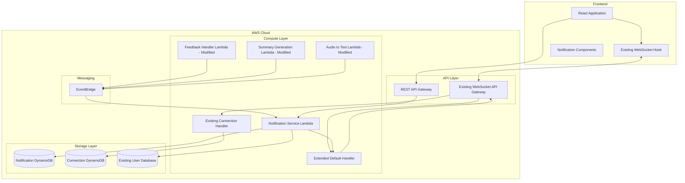
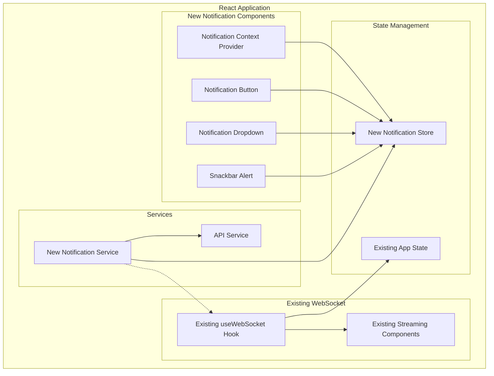

# Design Document: Notification System

## Overview

The notification system provides real-time and persistent notifications for an educational application with student, instructor, and admin roles. The system handles three primary notification types: feedback notifications when instructors provide feedback to students, completion notifications for summary generation, and completion notifications for case transcription.

The architecture leverages AWS services including API Gateway WebSocket API for real-time communication, DynamoDB for notification persistence, and Lambda functions for notification processing. The React frontend implements a notification dropdown menu and temporary snackbar alerts to provide both persistent and immediate notification visibility.

## Architecture

The notification system leverages the existing WebSocket infrastructure used for streaming LLM responses, extending it to support real-time notification delivery. This approach reuses the established WebSocket API Gateway, connection management, and frontend WebSocket hooks while adding notification-specific functionality.

### Backend Architecture



### Frontend Architecture



## Components and Interfaces

### Backend Components

#### WebSocket API Gateway
- **Purpose**: Manages persistent WebSocket connections for real-time notification delivery
- **Routes**:
  - `$connect`: Handles new WebSocket connections
  - `$disconnect`: Handles WebSocket disconnections
  - `$default`: Handles incoming WebSocket messages
- **Integration**: Lambda functions for connection management and message routing

#### Modified WebSocket Default Handler
- **Purpose**: Modify existing `default.js` to add notification message routing alongside existing streaming actions
- **Responsibilities**:
  - Route existing streaming messages (text generation, summary generation, assess progress)
  - Handle new notification delivery messages from the Notification Service Lambda
  - Maintain full backward compatibility with existing streaming functionality
- **Changes**: Add notification action handling to existing switch statement in `default.js`
- **Interface**:
  ```typescript
  // New notification actions added to existing handler
  interface NotificationWebSocketMessage {
    action: 'notification_delivery'; // New action type
    type: 'feedback' | 'summary_complete' | 'transcript_complete';
    notification: NotificationRecord;
  }
  ```

#### Modified Connection Handler
- **Purpose**: Modify existing connection handlers to store connection-to-user mapping
- **Responsibilities**:
  - Maintain existing connection authentication and lifecycle management
  - Store connection ID to user ID mapping in DynamoDB for notification targeting
  - Clean up connection mappings on disconnect
- **Changes**: Add DynamoDB write operations to existing `connect.js` and `disconnect.js`

#### Notification Service Lambda
- **Purpose**: Core notification processing, storage, and delivery
- **Responsibilities**:
  - Process notification events from EventBridge
  - Store notifications in DynamoDB
  - Deliver notifications via WebSocket to connected users
  - Handle notification queries and updates
- **Interface**:
  ```typescript
  interface NotificationEvent {
    type: 'feedback' | 'summary_complete' | 'transcript_complete';
    recipientId: string;
    title: string;
    message: string;
    metadata: Record<string, any>;
    createdBy?: string;
  }
  
  interface NotificationRecord {
    notificationId: string;
    userId: string;
    type: string;
    title: string;
    message: string;
    metadata: Record<string, any>;
    isRead: boolean;
    createdAt: string;
    readAt?: string;
    createdBy?: string;
  }
  ```

#### Event Publishers (Modified Existing Lambdas)
- **Existing Summary Generation Lambda**: Modified to publish summary completion events to EventBridge
- **Existing Audio to Text Lambda**: Modified to publish transcription completion events to EventBridge
- **Existing Feedback Handler Lambda**: Modified to publish feedback notification events to EventBridge

### Frontend Components

#### New Notification Service (Frontend)
- **Purpose**: Standalone service for managing notifications, separate from existing WebSocket streaming
- **Responsibilities**:
  - Listen for notification messages on the existing WebSocket connection
  - Fetch notification history from REST API
  - Mark notifications as read
  - Manage notification state independently from streaming functionality
- **Interface**:
  ```typescript
  interface NotificationService {
    initialize(wsConnection: WebSocket): void;
    getNotifications(page?: number, limit?: number): Promise<NotificationPage>;
    markAsRead(notificationId: string): Promise<void>;
    markAllAsRead(): Promise<void>;
    getUnreadCount(): Promise<number>;
    onNotification(callback: (notification: Notification) => void): void;
    onError(callback: (error: string) => void): void;
  }
  ```

#### Notification Service
- **Purpose**: Manages notification data and API interactions
- **Responsibilities**:
  - Fetch notification history from API
  - Mark notifications as read
  - Manage notification state
  - Handle pagination for large notification lists
- **Interface**:
  ```typescript
  interface NotificationService {
    getNotifications(page?: number, limit?: number): Promise<NotificationPage>;
    markAsRead(notificationId: string): Promise<void>;
    markAllAsRead(): Promise<void>;
    getUnreadCount(): Promise<number>;
  }
  
  interface NotificationPage {
    notifications: Notification[];
    totalCount: number;
    hasMore: boolean;
    nextPage?: number;
  }
  ```

#### Notification UI Components

**New Notification Components**
- **NotificationProvider**: React context provider for notification state management
- **NotificationButton**: Header button with unread count badge
- **NotificationDropdown**: Persistent dropdown menu showing notification list  
- **SnackbarAlert**: Temporary notification alert component

**Props Interfaces:**
```typescript
interface NotificationButtonProps {
  unreadCount: number;
  onClick: () => void;
  isOpen: boolean;
}

interface NotificationDropdownProps {
  notifications: Notification[];
  isLoading: boolean;
  hasMore: boolean;
  onLoadMore: () => void;
  onMarkAsRead: (id: string) => void;
  onMarkAllAsRead: () => void;
}

interface SnackbarAlertProps {
  notification: Notification;
  onDismiss: () => void;
  autoHideDuration?: number;
}

interface NotificationProviderProps {
  children: React.ReactNode;
  wsConnection?: WebSocket; // Optional existing WebSocket connection
}
```

## Data Models

### Notification Table (DynamoDB)

**Primary Table Structure:**
```typescript
interface NotificationRecord {
  PK: string;           // "USER#{userId}"
  SK: string;           // "NOTIFICATION#{timestamp}#{notificationId}"
  GSI1PK: string;       // "NOTIFICATION#{notificationId}"
  GSI1SK: string;       // "USER#{userId}"
  
  notificationId: string;
  userId: string;
  type: 'feedback' | 'summary_complete' | 'transcript_complete';
  title: string;
  message: string;
  metadata: {
    feedbackId?: string;
    summaryId?: string;
    transcriptId?: string;
    caseId?: string;
    [key: string]: any;
  };
  isRead: boolean;
  createdAt: string;    // ISO timestamp
  readAt?: string;      // ISO timestamp
  createdBy?: string;   // userId of creator (for feedback notifications)
  ttl: number;          // Unix timestamp for 30-day expiration
}
```

**Access Patterns:**
1. Get notifications for user (PK = "USER#{userId}", SK begins with "NOTIFICATION#")
2. Get specific notification (GSI1PK = "NOTIFICATION#{notificationId}")
3. Query unread notifications (PK = "USER#{userId}", filter isRead = false)

### Connection Table (DynamoDB)

**Table Structure:**
```typescript
interface ConnectionRecord {
  PK: string;           // "CONNECTION#{connectionId}"
  SK: string;           // "USER#{userId}"
  GSI1PK: string;       // "USER#{userId}"
  GSI1SK: string;       // "CONNECTION#{connectionId}"
  
  connectionId: string;
  userId: string;
  connectedAt: string;  // ISO timestamp
  lastActivity: string; // ISO timestamp
  ttl: number;          // Unix timestamp for 24-hour expiration
}
```

**Access Patterns:**
1. Get connection by ID (PK = "CONNECTION#{connectionId}")
2. Get all connections for user (GSI1PK = "USER#{userId}")

### Notification Types

**Feedback Notification:**
```typescript
interface FeedbackNotification {
  type: 'feedback';
  title: 'New Feedback Received';
  message: string;      // "You have received feedback on [assignment/case name]"
  metadata: {
    feedbackId: string;
    caseId: string;
    caseName: string;
    instructorName: string;
  };
}
```

**Summary Generation Notification:**
```typescript
interface SummaryNotification {
  type: 'summary_complete';
  title: 'Summary Generation Complete';
  message: string;      // "Your case summary has been generated successfully"
  metadata: {
    summaryId: string;
    caseId: string;
    caseName: string;
    status: 'success' | 'failed';
    errorMessage?: string;
  };
}
```

**Transcript Notification:**
```typescript
interface TranscriptNotification {
  type: 'transcript_complete';
  title: 'Transcription Complete';
  message: string;      // "Your case transcription has been completed"
  metadata: {
    transcriptId: string;
    caseId: string;
    caseName: string;
    status: 'success' | 'failed';
    errorMessage?: string;
  };
}
```

## Correctness Properties

*A property is a characteristic or behavior that should hold true across all valid executions of a system—essentially, a formal statement about what the system should do. Properties serve as the bridge between human-readable specifications and machine-verifiable correctness guarantees.*

After analyzing the acceptance criteria, I identified several redundant properties that can be consolidated:

**Property Reflection:**
- Properties 1.2, 2.4, and 3.4 all test WebSocket delivery for online users - can be combined into one comprehensive property
- Properties 1.4, 2.5, and 3.5 all test snackbar display - can be combined into one property with different conditions
- Properties 2.2, 2.3, 3.2, and 3.3 all test completion notification creation - can be combined into one property covering both success and failure cases
- Properties 5.1 and 5.2 both test delivery timing - can be combined into one comprehensive delivery property

### Property 1: Notification Creation and Persistence
*For any* notification event (feedback, summary completion, or transcription completion), the system should create a notification record in the database with all required fields (timestamp, type, recipient, content, read status) and associate it with the correct user.
**Validates: Requirements 1.1, 2.2, 2.3, 3.2, 3.3, 4.1, 8.1**

### Property 2: Real-time Delivery for Online Users
*For any* notification created for an online user, the WebSocket manager should deliver it immediately to all active sessions for that user.
**Validates: Requirements 1.2, 2.4, 3.4, 5.1, 5.4**

### Property 3: Offline Notification Persistence and Delivery
*For any* notification created for an offline user, the system should persist it and deliver all undelivered notifications when the user comes online.
**Validates: Requirements 1.3, 5.2**

### Property 4: Snackbar Display Behavior
*For any* notification received via WebSocket, the UI should display a snackbar alert for exactly 5 seconds, with conditional display based on current page context (always for feedback, only on relevant pages for completion notifications).
**Validates: Requirements 1.4, 2.5, 3.5, 6.1**

### Property 5: Notification Dropdown Integration
*For any* notification created, it should appear in the user's notification dropdown in reverse chronological order and be marked as read when viewed.
**Validates: Requirements 1.5, 4.2, 4.3, 4.4**

### Property 6: Process Tracking
*For any* long-running process (summary generation or transcription), the system should track the process and create appropriate notifications upon completion or failure.
**Validates: Requirements 2.1, 3.1**

### Property 7: Visual State Updates
*For any* notification state change (read/unread), the UI should update visual indicators including read status appearance, unread count badge, and notification button indicator.
**Validates: Requirements 4.5, 6.3, 6.4**

### Property 8: WebSocket Reliability
*For any* WebSocket delivery failure, the system should retry with exponential backoff, and the UI should automatically attempt reconnection when connection is lost.
**Validates: Requirements 5.3, 5.5**

### Property 9: Snackbar Queue Management
*For any* multiple simultaneous notifications, the UI should queue snackbar alerts to prevent overlap and provide dismiss actions for immediate removal.
**Validates: Requirements 6.2, 6.5**

### Property 10: Access Control and Data Isolation
*For any* notification query or creation, the system should enforce that users only receive notifications intended for them (feedback to specific students, completion notifications to process initiators).
**Validates: Requirements 7.1, 7.2, 7.3**

### Property 11: Data Lifecycle Management
*For any* notification older than 30 days, the system should archive it, and for any deletion operation, the system should soft-delete to maintain audit trails.
**Validates: Requirements 8.2, 8.5**

### Property 12: UI Pagination and Performance
*For any* user with more than 100 notifications, the dropdown should implement pagination to maintain performance.
**Validates: Requirements 8.3**

## Error Handling

### WebSocket Connection Errors
- **Connection Failures**: Implement exponential backoff retry strategy with maximum retry limits
- **Authentication Errors**: Clear invalid tokens and redirect to login
- **Message Delivery Failures**: Store failed messages for retry and fallback to polling

### Database Errors
- **Write Failures**: Implement retry logic with dead letter queues for persistent failures
- **Read Failures**: Provide graceful degradation with cached data when available
- **Connection Timeouts**: Implement circuit breaker pattern to prevent cascade failures

### Notification Processing Errors
- **Invalid Notification Data**: Validate notification structure and reject malformed notifications
- **Missing User Data**: Handle cases where recipient users don't exist or are inactive
- **Duplicate Notifications**: Implement idempotency keys to prevent duplicate notifications

### UI Error Handling
- **WebSocket Disconnection**: Show connection status indicator and attempt automatic reconnection
- **Failed API Calls**: Display error messages and provide retry options
- **Rendering Errors**: Implement error boundaries to prevent UI crashes

## Testing Strategy

### Dual Testing Approach
The notification system requires both unit tests and property-based tests for comprehensive coverage:

**Unit Tests** focus on:
- Specific notification scenarios and edge cases
- Integration points between WebSocket and database layers
- Error conditions and failure modes
- UI component behavior with specific inputs

**Property Tests** focus on:
- Universal properties that hold across all notification types
- Comprehensive input coverage through randomization
- System behavior under various load conditions
- Data consistency across concurrent operations

### Property-Based Testing Configuration
- **Testing Library**: Use fast-check for TypeScript/JavaScript property tests
- **Minimum Iterations**: 100 iterations per property test
- **Test Tagging**: Each property test must reference its design document property
- **Tag Format**: **Feature: notification-system, Property {number}: {property_text}**

### Testing Environments
- **Unit Tests**: Jest with React Testing Library for frontend, Jest with AWS SDK mocks for backend
- **Integration Tests**: LocalStack for AWS service simulation
- **End-to-End Tests**: Playwright for full user workflow testing
- **Load Tests**: Artillery.js for WebSocket connection and notification volume testing

### Key Testing Scenarios
1. **Concurrent Notifications**: Multiple users receiving notifications simultaneously
2. **Connection Resilience**: Network interruptions and reconnection behavior
3. **Large Notification Volumes**: Performance with high notification throughput
4. **Cross-Browser Compatibility**: WebSocket behavior across different browsers
5. **Mobile Responsiveness**: Notification UI behavior on mobile devices