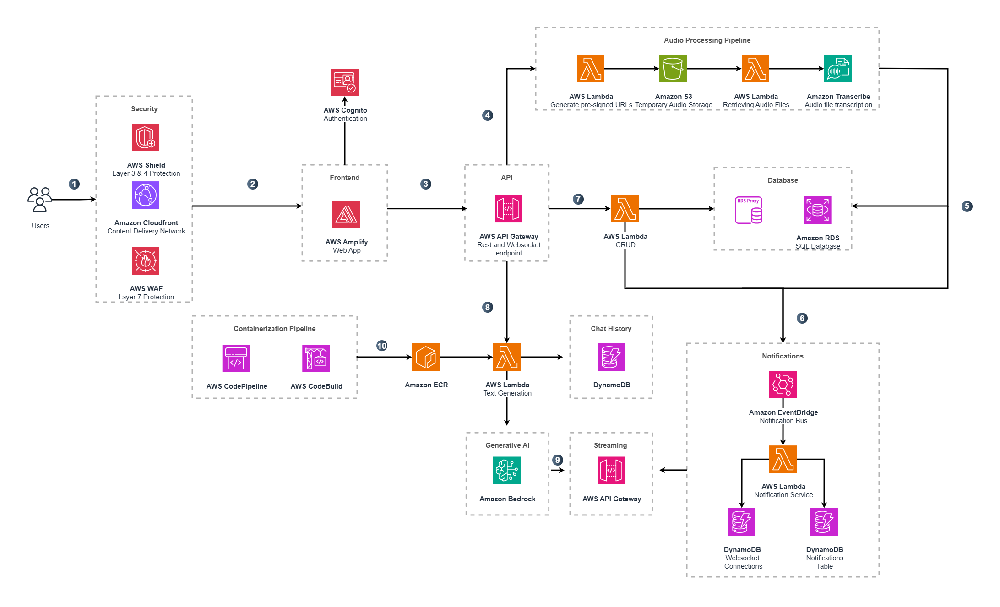
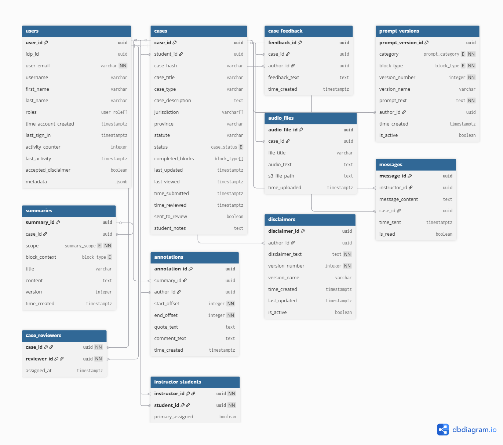

# Architecture Deep Dive

## Architecture

_TODO: update diagram to reflect current services (WebSocket API, EventBridge notifications, Docker case-gen, etc.)_

1. **Edge and security** – all traffic passes through AWS WAF, CloudFront and Shield before reaching APIs. This layer provides IP filtering, rate‑limiting and basic bot protection.
2. **Frontend** – a React single‑page application hosted on Amplify (S3/CloudFront). Cognito manages authentication and issues JWTs which the frontend uses when calling backend services.
3. **API layer** – the backend surface consists of two main endpoints:
   - A REST API implemented with API Gateway that routes requests to a suite of backend compute services. Each path is protected by Cognito‑aware authorizers enforcing role/group permissions (student, instructor, admin, supervisor).
   - A WebSocket API (API Gateway with custom authorizer) used for low‑latency streaming interactions such as AI chat, and real‑time notifications.
4. **Audio workflow** – when a user uploads audio for transcription:
   1. The frontend obtains a presigned URL for the protected S3 bucket.
   2. The file is uploaded directly to S3, triggering backend processing that validates the file and starts an Amazon Transcribe job.
   3. Transcription output is post‑processed (speaker diarization, PII masking) and stored in the relational database.
   4. An EventBridge event is emitted; downstream notification logic delivers a real‑time update to the user via the WebSocket channel.
5. **Case management** – all operations around cases, feedback, reviewers, prompts and related entities traverse the REST API and persist changes in an Amazon RDS PostgreSQL database accessed through an RDS Proxy. This relational store holds the canonical application data.
6. **AI services** – backend compute components retrieve context from RDS and conversational history from a DynamoDB table, then call Amazon Bedrock (using models such as Llama‑3) to generate summaries, reasoning output or full‑case drafts. Some of these services run in Docker images built by the CI/CD pipeline.
7. **Conversation streaming** – chat messages flow over the WebSocket API into a compute handler that writes to DynamoDB and streams requests to Bedrock. Responses are pipelined back over the same socket for real‑time interaction.
8. **Notifications & events** – an EventBridge bus transports domain events (transcriptions completed, summaries ready, case reviewed, etc.). A notification service consumes these events, persists records in DynamoDB, and pushes updates to connected clients via WebSocket or other channels.
9. **Supporting services** – additional backend routines handle user onboarding and role changes, progress tracking, supervisor/admin utilities, and other ancillary workflows. These services leverage the same API/compute infrastructure.
10. **Infrastructure & deployment** – AWS CDK defines all resources. CI/CD is provided by CodePipeline/CodeBuild; Docker images for case‑generation and text‑generation are built, tagged, and deployed to Lambda or ECR automatically.
11. **Database access & performance** – most Lambdas run inside a VPC and connect via RDS Proxy for efficient pooling. DynamoDB tables back transient data (chat history, notifications, playground / case generation caches).

### Database Schema

#### RDS Tables

##### `users`

| Column                 | Description                                             |
| ---------------------- | ------------------------------------------------------- |
| `user_id`              | UUID PK                                                 |
| `idp_id`               | External identity provider ID (Cognito or others)       |
| `user_email`           | Unique email                                            |
| `username`             | Display name                                            |
| `first_name`           | First name of the user                                  |
| `last_name`            | Last name of the user                                   |
| `roles`                | Array of `user_role` (`student`/`instructor`/`admin`)   |
| `time_account_created` | Timestamp when the user's account was initially created |
| `last_sign_in`         | Timestamp of the user's most recent login               |
| `activity_counter`     | Count of AI messages sent by the user in the past 24h   |
| `last_activity`        | Timestamp of the user's last recorded activity          |
| `accepted_disclaimer`  | True if user has agreed to the current disclaimer       |
| `metadata`             | JSONB field for miscellaneous user metadata             |

##### `cases`

| Column             | Description                                                                    |
| ------------------ | ------------------------------------------------------------------------------ |
| `case_id`          | UUID PK                                                                        |
| `student_id`       | FK → `users`                                                                   |
| `case_hash`        | Unique base64 hash                                                             |
| `case_title`       | Human‑readable title of the case                                               |
| `case_type`        | Category or classification of the legal case                                   |
| `case_description` | Full description of the legal matter provided by the student                   |
| `jurisdiction`     | List of relevant jurisdictions (e.g. Federal, Provincial)                      |
| `province`         | Province associated with the case (defaults to N/A)                            |
| `statute`          | Statutory reference or law section relevant to the case                        |
| `status`           | Current lifecycle status of the case (in_progress/submitted/reviewed/archived) |
| `completed_blocks` | List of section types that the student has finished working on                 |
| `last_updated`     | Timestamp of the most recent modification to the case record                   |
| `last_viewed`      | When the student last opened or viewed the case                                |
| `time_submitted`   | Timestamp when the student submitted the case for review                       |
| `time_reviewed`    | When an instructor or reviewer completed their review of the case              |
| `sent_to_review`   | Indicates whether the case has been flagged for instructor review              |
| `student_notes`    | Free‑form notes the student adds to the case                                   |

##### `case_feedback`

| Column          | Description                                                    |
| --------------- | -------------------------------------------------------------- |
| `feedback_id`   | UUID PK                                                        |
| `case_id`       | FK→`cases`                                                     |
| `author_id`     | FK→`users`                                                     |
| `feedback_text` | Feedback written by an instructor or reviewer regarding a case |
| `time_created`  | Timestamp when the feedback entry was submitted                |

##### `prompt_versions`

| Column              | Description                                                       |
| ------------------- | ----------------------------------------------------------------- |
| `prompt_version_id` | UUID PK                                                           |
| `category`          | Classification of the prompt (reasoning or assessment)            |
| `block_type`        | Section type the prompt applies to (intake, legal_analysis, etc.) |
| `version_number`    | Sequential version index for the prompt                           |
| `version_name`      | Optional human‑readable name for the prompt version               |
| `prompt_text`       | Prompt content used when generating AI responses                  |
| `author_id`         | FK→`users`                                                        |
| `time_created`      | When the prompt version was added to the system                   |
| `is_active`         | Marks whether this prompt version is currently in use             |

##### `summaries`

| Column          | Description                                                      |
| --------------- | ---------------------------------------------------------------- |
| `summary_id`    | UUID PK                                                          |
| `case_id`       | FK→`cases`                                                       |
| `scope`         | Indicates whether summary covers a single block or the full case |
| `block_context` | Block type context for which the summary was generated           |
| `title`         | Optional title for the summary                                   |
| `content`       | Generated summary or reasoning text for the case                 |
| `version`       | Version number of the summary (increments on edits)              |
| `time_created`  | Timestamp when the summary was generated                         |

##### `annotations`

| Column          | Description                                                  |
| --------------- | ------------------------------------------------------------ |
| `annotation_id` | UUID PK                                                      |
| `summary_id`    | FK→`summaries`                                               |
| `author_id`     | FK→`users`                                                   |
| `start_offset`  | Character index where the annotation begins                  |
| `end_offset`    | Character index where the annotation ends                    |
| `quote_text`    | Quoted excerpt from a summary that the annotation highlights |
| `comment_text`  | Comment provided by the annotator concerning the quote       |
| `time_created`  | Timestamp when the annotation was added                      |

##### `audio_files`

| Column          | Description                                               |
| --------------- | --------------------------------------------------------- |
| `audio_file_id` | UUID PK                                                   |
| `case_id`       | FK→`cases`                                                |
| `file_title`    | Original filename or title associated with the audio file |
| `audio_text`    | Transcription output produced from the audio file         |
| `s3_file_path`  | S3 key/location of the uploaded audio file                |
| `time_uploaded` | When the audio file was uploaded                          |

##### `messages`

| Column            | Description                                                               |
| ----------------- | ------------------------------------------------------------------------- |
| `message_id`      | UUID PK                                                                   |
| `instructor_id`   | FK→`users`                                                                |
| `message_content` | Text body of a message sent between users (usually instructor to student) |
| `case_id`         | FK→`cases`                                                                |
| `time_sent`       | When the message was sent                                                 |
| `is_read`         | Whether the recipient has read the message                                |

##### `case_reviewers`

| Column        | Description                                |
| ------------- | ------------------------------------------ |
| `case_id`     | FK→`cases`                                 |
| `reviewer_id` | FK→`users`                                 |
| `assigned_at` | When the reviewer was assigned to the case |

##### `instructor_students`

| Column             | Description                                                   |
| ------------------ | ------------------------------------------------------------- |
| `instructor_id`    | FK→`users`                                                    |
| `student_id`       | FK→`users`                                                    |
| `primary_assigned` | Indicates if this instructor is the student's primary teacher |

##### `disclaimers`

| Column            | Description                                                   |
| ----------------- | ------------------------------------------------------------- |
| `disclaimer_id`   | UUID PK                                                       |
| `author_id`       | FK→`users`                                                    |
| `disclaimer_text` | Content of the disclaimer presented to users during sign‑up   |
| `version_number`  | Sequential version number for the disclaimer                  |
| `version_name`    | Optional human‑readable label for the disclaimer version      |
| `time_created`    | Timestamp when this disclaimer version was created            |
| `last_updated`    | Timestamp of the last modification to the disclaimer          |
| `is_active`       | Indicates whether this disclaimer is the currently active one |

---
